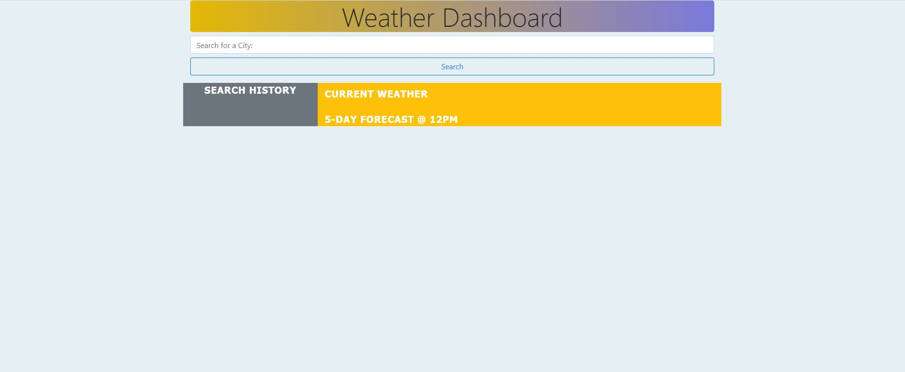
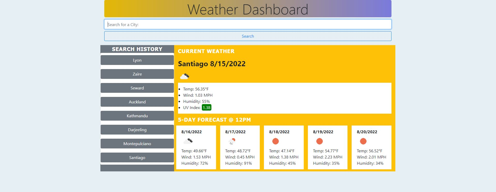

# Weather Dashboard
Find current and 5-day forecasts in any city with this simple weather finder

Data provided by OpenWeatherMap

## Table of Contents

- [Description](#description)
- [Deployed Application](#deployed-application)
- [Future Improvements](#future-improvements)
- [Installation](#installation)
- [Usage](#usage)
- [Credits](#credits)
- [License](#license)

## Description

*NOTE: the deployed application will no longer work for anyone who happens upon this particular public repo. Due to API call limitations, I have disabled the API key used in this app.

This weather finder allows a traveler to find the current and future 5-day forecast for any city he or she seeks. With simple but aesthetically pleasing html and css/Bootstrap layout, JavaScript powers this app in conjunction with the 3rd party API OpenWeatherMap via a server-side API, fetch. Moment.js also makes an appearance and helps the traveler know how many dates in the future the app provides weather data. The traveler has a convenient search history list on the left side should they choose to search.

## Deployed Application

https://miss-mad.github.io/weather-finder/

## Future Improvements

* Refactor the code to make it simpler by breaking down large functions into smaller ones that only perform single/small tasks.

* Add state and country codes as the OpenWeather API suggests so that users who search for a city name that may exist in more than one place can find that city more easily.

* Add a condition to the search history card so that it does not save misspelled or nonexisting city names in local storage and therefore doesn't display them in the history list, either

* Change/add to the css, where there's always room for improvement :)

## Installation

No installation necessary.

## Usage

Below are screenshots of the Weather Dashboard webpage.

## Credits

Collaborators:

Shawn Canavan - fellow bootcamper

List of resources used:

https://coding-boot-camp.github.io/full-stack/apis/how-to-use-api-keys

https://developer.mozilla.org/en-US/docs/Web/API/Fetch_API/Using_Fetch

https://openweathermap.org/api/one-call-3#how

https://openweathermap.org/current#call

https://openweathermap.org/forecast5

https://web.postman.co/workspace/3a6be0d9-6faa-4156-8ac5-a8e427e9f2a8/overview?workspaceOnboarding=show

https://getbootstrap.com/docs/5.0/layout/grid/

https://getbootstrap.com/docs/5.0/components/buttons/

https://momentjs.com/docs/#/displaying/format/

https://stackoverflow.com/questions/44177417/how-to-display-openweathermap-weather-icon

## License

No licenses.

---